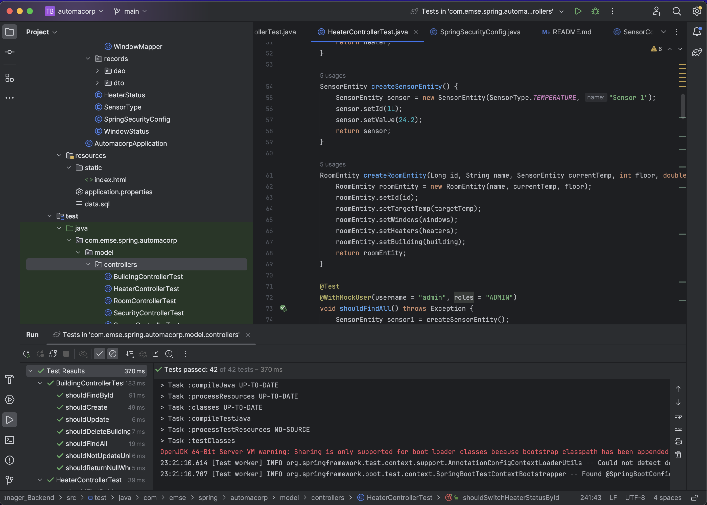
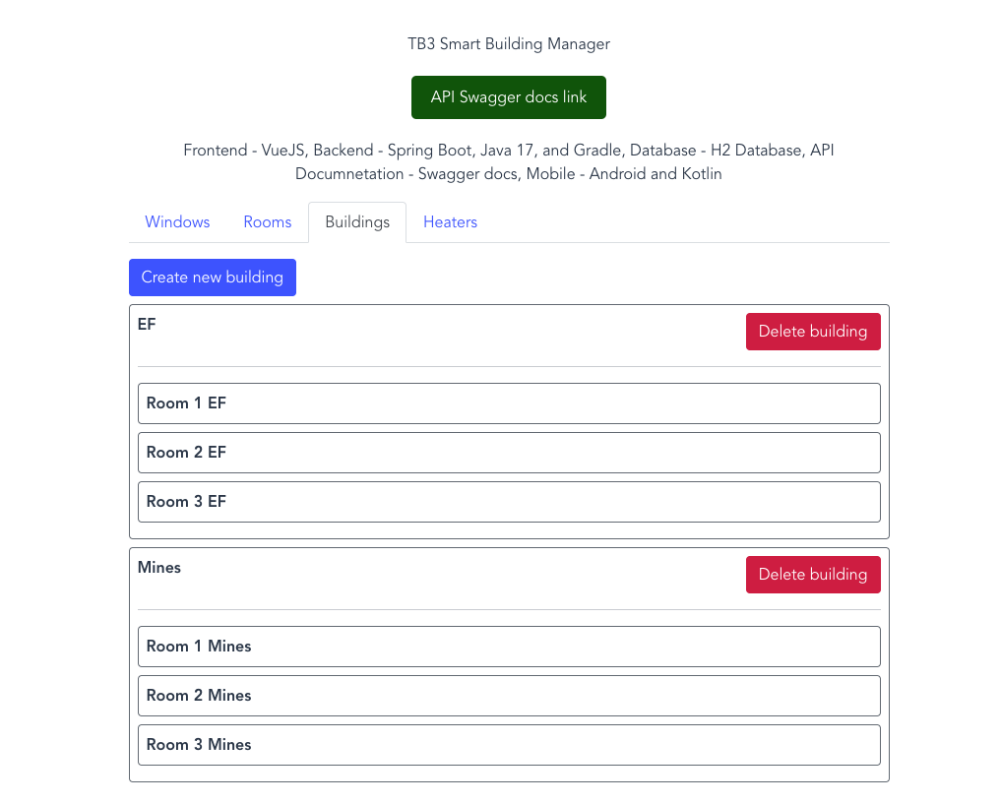
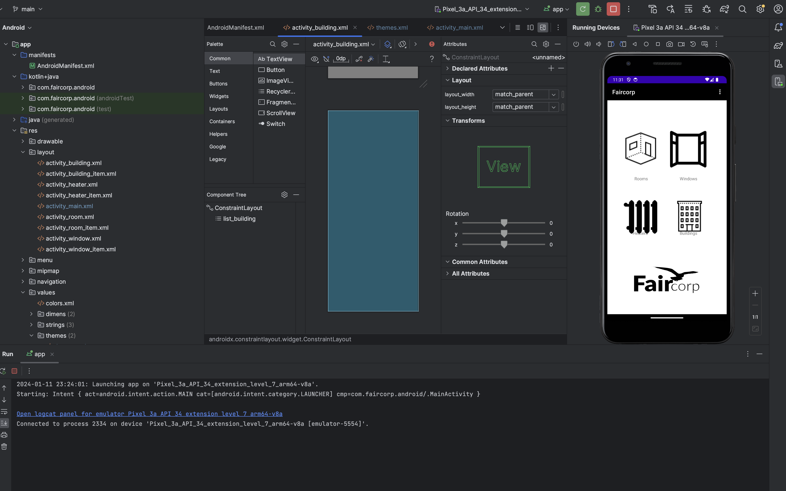

# TB3 Smart Building Manager Backend

## Table of Contents
- [Introduction](#introduction)
- [Features](#features)
- [Getting Started](#getting-started)
- [Usage](#usage)
- [Contributing](#contributing)
- [License](#license)
- [Acknowledgments](#acknowledgments)

## Introduction
TB3 Smart Building Manager Backend is a sophisticated application designed for managing smart buildings and related entities such as Rooms, Heaters, and Windows. Developed using the robust Spring Boot framework, this application integrates various dependencies including Spring Security, Spring JPA, and more. Rigorous testing is performed using JUnit and Mockito to ensure reliability and efficiency.

**Developer:** Anjolaoluwa Adeuyi Joshua

The application is currently deployed on Clever Cloud and can be accessed at:
[http://automacorp-anjola-adeuyi.cleverapps.io/](http://automacorp-anjola-adeuyi.cleverapps.io/)




## Features
- **User Roles**: Supports 'admin' and 'user' roles with secure login functionality.
- **API Endpoints**: Admin users can access and manage entities like Buildings, Rooms, Heaters, and Windows.
- **Entity Management**: Capability to manage entities by building or room, including deletion and control functions.

## Getting Started
The [backend repository](https://github.com/anjola-adeuyi/TB3_Smart_Building_Manager_Backend.git) as well as the corresponding [frontend vue.js repository](https://github.com/anjola-adeuyi/TB3_Smart_Building_Manager_Frontend_VueJS.git) are on GitHub, hosted on clevercloud at [automacorp-anjola-adeuyi.cleverapps.io](http://automacorp-anjola-adeuyi.cleverapps.io/) with a swagger docs API link at [automacorp-anjola-adeuyi.cleverapps.io/swagger-ui](https://automacorp-anjola-adeuyi.cleverapps.io/swagger-ui/index.html) and Java doc link at [Smart Building JavaDoc Link](https://anjola-adeuyi.github.io/TB3_Smart_Building_Manager_Backend).

## Usage
### API Information
#### User Authentication:
- Admin Role: Username - `admin`, Password - `password`
- User Role: Username - `user`, Password - `password`

#### API EndPoints:
- Buildings: [http://automacorp-anjola-adeuyi.cleverapps.io/api/buildings](http://automacorp-anjola-adeuyi.cleverapps.io/api/buildings)
- Rooms: [http://automacorp-anjola-adeuyi.cleverapps.io/api/rooms](http://automacorp-anjola-adeuyi.cleverapps.io/api/rooms)
- Heaters: [http://automacorp-anjola-adeuyi.cleverapps.io/api/heaters](http://automacorp-anjola-adeuyi.cleverapps.io/api/heaters)
- Windows: [http://automacorp-anjola-adeuyi.cleverapps.io/api/windows](http://automacorp-anjola-adeuyi.cleverapps.io/api/windows)

#### API Testing:
- **Information about testing the API, including links to API documentation or Swagger.**
- 


## Mobile App Development



```Link to the Mobile App Development Repository
https://github.com/anjola-adeuyi/tb3-android-app.git
```

## Contributing
Contributions to the TB3 Smart Building Manager Backend are immensely appreciated. If you're keen on improving or expanding the project, here are several ways you can participate:

- **Bug Reports**: Identify and report any issues to enhance the application's reliability.
- **Pull Request Contributions**: Offer code contributions via pull requests.
- **Feature Suggestions**: Share your ideas for new functionalities or enhancements.
- **Review and Feedback**: Engage in the process by reviewing code and providing feedback.

### Guidelines for Contribution
- Adherence to the code of conduct is expected.
- Engage in discussions via issues for substantial changes before commencing work.
- Aim for concise, targeted changes to facilitate a smoother review and integration process.

## License
The TB3 Smart Building Manager Backend is distributed under the MIT License, promoting open and unrestricted use, modification, and distribution of the software, with the necessity of preserving this license in all major derivatives of the software.

## Authors and Acknowledgments
**Developer:** Anjolaoluwa Adeuyi Joshua

For detailed information and the latest updates, please refer to the [backend repository](https://github.com/anjola-adeuyi/TB3_Smart_Building_Manager_Backend.git) as well as the corresponding [frontend repository](https://github.com/anjola-adeuyi/TB3_Smart_Building_Manager_Frontend_VueJS.git) on GitHub.

